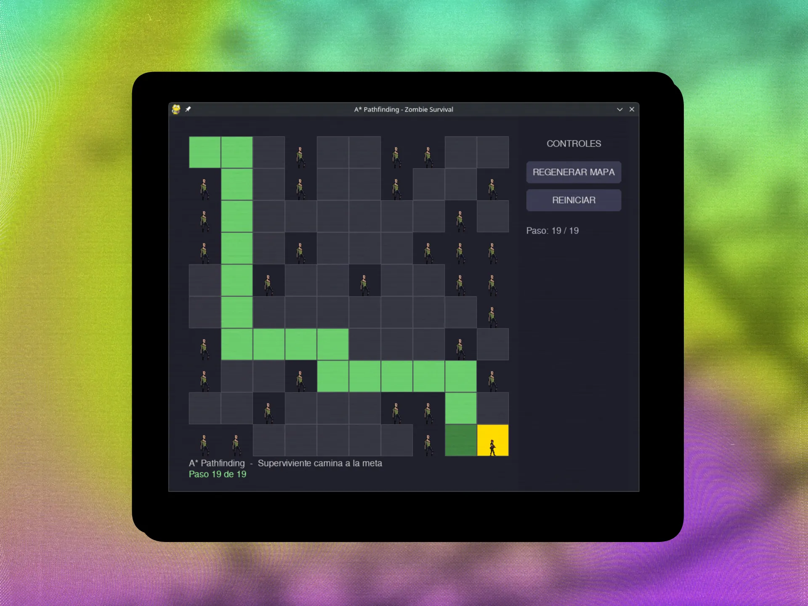

# A* Pathfinding — Zombie Survival



## Descripción

Visualización interactiva del algoritmo A* (A-Star) en Pygame. Un superviviente encuentra el camino óptimo esquivando zombis en un grid 10×10.

## Características

- Algoritmo A* funcional con heurística Manhattan
- Grid con obstáculos aleatorios generados como zombis
- Animación del personaje caminando sobre la ruta calculada
- Sidebar interactivo:
  - **Regenerar mapa** — genera nuevos obstáculos y recalcula la ruta
  - **Reiniciar** — vuelve la animación al paso inicial

## Requisitos

- Python 3.13+
- pygame 2.6.1

## Instalación y ejecución

```bash
python -m venv venv
source venv/bin/activate
pip install -r requirements.txt
./venv/bin/python main.py
```

## Controles

| Botón             | Acción                                         |
|-------------------|------------------------------------------------|
| REGENERAR MAPA    | Genera nuevos obstáculos y recalcula la ruta   |
| REINICIAR         | Reinicia la animación desde el paso inicial     |

## Sprites

- [Zombie — Craftpix Free Zombie Sprite Sheet Pack](https://craftpix.net/)
- [Raider — Craftpix Free Raider Sprite Sheets](https://craftpix.net/)

## Estructura del proyecto

```
├── config.py          # Constantes y configuración
├── pathfinding.py     # Algoritmo A* (Nodo, heurística, mapeo)
├── graphics.py        # Renderizado Pygame (grid, sprites, sidebar)
├── main.py            # Punto de entrada y game loop
├── sprites/           # Spritesheets
├── mockup/            # Imagen de preview
└── requirements.txt   # Dependencias
```
